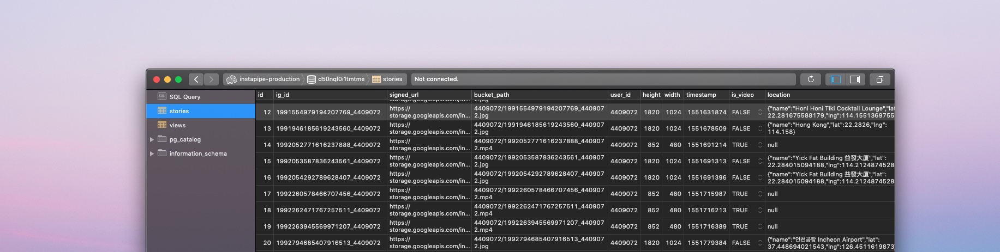

<h1 style="text-align: center;">instapipe.net</h1>

  

  

  

    

      
      
<a href="https://instagram.com/krausefx" target="_blank">KrauseFx</a>

      

      
<a href="https://instapipe.net" target="_blank">instapipe.net</a>

    

    

    

      &#x3C;
    

    

      &#x3E; 
    

    <video autoplay playsinline muted id="storyVideoViewer">
    </video>
    

    

  

  

<b>⬆️ Give it a try, click on the picture ⬆️</b>

 

## Background

You want to share experiences as they are happening in your life. Instagram Stories is a great way to do so, thanks to cross-posting to Facebook, Messenger and Instagram itself, allowing most people to view your stories.

However just like Snapchat, the platforms try to lock you in, with the content **you** create. Many of my family members and close friends don't use FB/IG daily, but still wanted to stay up to date on what I'm up to.

Due to lack of an official API, and any kinds of integrations, the only way to access your stories is through the unofficial API the Instagram mobile- and web client use.

## Solution

A simple web service that automatically downloads and publishes your stories on various platforms. It's open source and fully self hosted, check it out [on GitHub](https://github.com/KrauseFx/instapipe).

### Embed into websites

Showing what you're up to on the websites you operate is an easy way to make your online presence more personal.

- [On whereisfelix.today](https://whereisfelix.today)
- [Integrated into krausefx.com](https://krausefx.com) (desktop only)
- [Plain live demo](https://krausefx.github.io/instapipe/web/index.html)
- [Top of this page]("#")

**Features**

- Design similar to instagram.com web
- Arrow keys to go back and forth between stories
- Support for photos and videos
- Support for desktop and mobile browsers
- Dismiss stories using ESC key, and clicking the dimmed area
- Pre-loading of the next story for instant rendering
- Basic features like rendering of the progress bar, the relative time stamp, as well as linking to your profile
- Zero dependencies, plain JavaScript, CSS and HTML in a single file

### Provide a JSON API

Of course it also provides you with a JSON API, that can be used to integrate your Instagram stories into any app or service. The API includes all relevant data, including the raw image, location and the exact resolution of the media assets.

[https://instapipe.herokuapp.com/stories.json?user_id=4409072](https://instapipe.herokuapp.com/stories.json?user_id=4409072)

Make sure to manually copy & paste this in a new tab to avoid the cross-site scripting protection

### Telegram group

Many of my friends don't want to check Instagram every day, but still want to stay up to date with what I'm up to. Since they all use Telegram already, I set up a channel that automatically shows the stories I post.

A [Telegram group](https://t.me/joinchat/AAAAAFADGfZcXqQj3TK73A) containing all my latest stories. In particular nice to get an overview over all your most recent stories. Join it [here](https://t.me/joinchat/AAAAAFADGfZcXqQj3TK73A).

## How it works

Instapipe is a simple server, that periodically fetches your most recent Instagram stories. As soon as a new story is available, it will

- Download the highest resolution photo/video and store it on your personal Google Cloud Bucket
- Store the associated metadata in a database you own, the data includes
  - 24 hours signed URL to the full-resolution photo/video of your Google Cloud Storage
  - The full path of the resource referencing your Google Cloud bucket
  - The user ID who published the asset
  - The height and width of the photo/video
  - The exact time stamp of publishing
  - An `is_video` flag
  - The location (if a location tag is attached)
    - Location Name (e.g. `Das Gym`)
    - `lat` and `lng` coordinates
- Post the new story into a Telegram group ([check it out here](https://t.me/joinchat/AAAAAFADGfZcXqQj3TK73A))

At the same time, some very basic metrics will be stored:

- Per day, how many people watched at least one story (not unique users, if a user watches at least one twice, it will be counted twice)
- Per day, how many times were the stories pre-fetched (meaning the instapipe code was loaded)

The above metrics should only give you a rough idea on how many people have watched stories, no personal data is stored from the users, I don't want this to be the reason to add a cookie warning to a website.

## Can I use it?

For now, you'll have to be an engineer to be able to use it, as instapipe.net is completely self-hosted. Check out the [GitHub repo](https://github.com/krausefx/instapipe) to access instructions and the source code, in particular [`DEVELOPMENT.md`](https://github.com/KrauseFx/instapipe/blob/master/DEVELOPMENT.md).

If you're not an engineer, and are interested in using this on your website, via a Telegram channel or another platform, please drop me a message on [Twitter@KrauseFx](https://twitter.com/KrauseFx) or [Instagram@KrauseFx](https://instagram.com/KrauseFx), so I can see if demand is there to put in the extra work to provide instapipe as a service.

## Potential

This is just the beginning, highly optimized for what I needed the bot for. There are so many other interesting things that could be built on top.

### Plug & Play integrations

Right now Telegram and the API are hard-coded. However ideally you could write plugins or integrations to pipe the data over to any other platform. Maybe even an integration with [IFTTT](https://ifttt.com) would make sense ([#13](https://github.com/KrauseFx/instapipe/issues/13)).

### Multi-user support

Right now, this project only supports a single user at a time. It's designed in a way to support any number of users in the future ([#22](https://github.com/KrauseFx/instapipe/issues/new)).

### Rendering of a map/globe

A map or a 3D globe, moving around, as the stories are rendered or maybe even a map view, with the stories on the map, onclick renders the story ([#12](https://github.com/KrauseFx/instapipe/issues/12)).

### Embed pinned stories

Integrating your pinned stories onto your website would be a cool feature, however I didn't need it for myself ([#3](https://github.com/KrauseFx/instapipe/issues/3)).

### Provide RSS feed

Publishing an RSS feed would be an easy way to integrate into various services, including IFTTT ([#6](https://github.com/KrauseFx/instapipe/issues/6)).

 

  <small>Website generated using <a href="https://markdown-to-github-style-web.com/" target="_blank">markdown-to-html-github-style.com</a></small>

